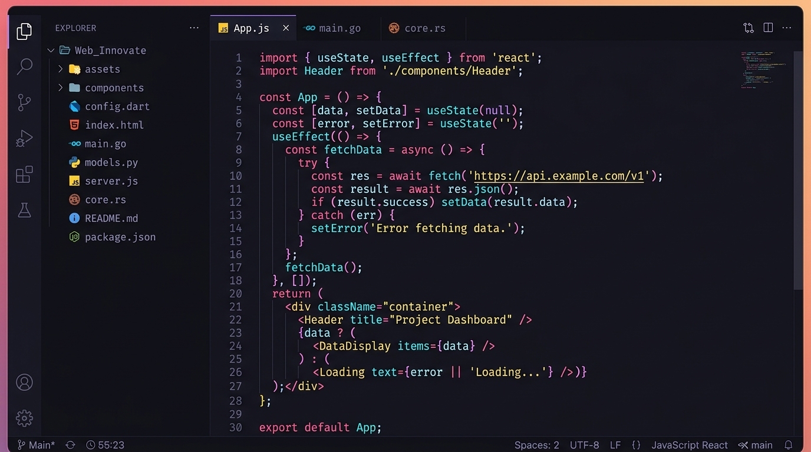

# 🌈 Spectrum Editor Customization Package

[](https://opensource.org/licenses/MIT)
[](package.json)
[](src/index.js)
[](test/test-package.js)

A modular, lightweight, and zero-dependency customization toolkit for code editors, IDE extensions, and web-based syntax viewers. Provides vector-crisp **SVG file icon mapping** with safe resolution, **language-aware syntax color token styling**, and an **extensible lexical tokenizer**.

---

## 📸 Preview



---

## 🏷️ Metadata Tags

`#code-editor` `#syntax-highlighting` `#svg-icons` `#theme-engine` `#javascript` `#dart` `#flutter` `#html` `#python` `#rust` `#golang` `#developer-tools`

---

## ✨ Features

- 📁 **Rich SVG File Icon Mapping**:
  - Over 25+ programming languages, file extensions (`.js`, `.dart`, `.html`, `.py`, `.rs`, `.go`, `.ts`, `.cpp`, `.cs`, `.java`, `.kt`, `.swift`, `.php`, `.rb`, `.sh`, `.sql`, `.css`, `.json`, `.yaml`, `.md`, `.txt`), and special filenames (`package.json`, `pubspec.yaml`, `Dockerfile`, `.gitignore`, `.env`).
  - Bulletproof safety resolver `getFileIcon(fileName)` that gracefully handles dotfiles, compound extensions (`.test.tsx`, `.d.ts`), missing paths, and missing extensions with custom fallback support.

- 🎨 **Multi-Language Syntax Color & Palette System**:
  - Central color token architecture targeting **Keywords**, **Functions/Methods**, **Strings**, **HTML Tags & Attributes**, **Types/Widgets**, **Comments**, **Numbers**, and **Constants**.
  - 5 High-Contrast Visual Themes:
    - 🌑 **Spectrum Obsidian** (Modern Dark)
    - 🌆 **Tokyo Twilight** (Tokyo Night aesthetic)
    - ⚡ **Cyberpunk Neon** (Vibrant Electric Synth)
    - ❄️ **Nordic Frost** (Polar Arctic Slate)
    - 🪐 **Solarized Precision** (Harmonious Solarized Dark)
  - `getTokenStyle(tokenType, language, theme)` returning computed colors, font weights, inline CSS styles, and CSS classes.

- ⚡ **Real-Time Tokenizer & Syntax Highlighter**:
  - Regex-powered lexical analyzer supporting single/multi-line comments, doc comments (`///`), string literals, HTML tag and attribute parsing, and function invocation detection.

- 🖥️ **Live Interactive Web Showcase UI**:
  - Full editor UI with sidebar file tree, SVG icon badges, multi-tab switching, line-synced editing area, active token inspector, and live theme switcher.

---

## 📦 Project Structure

```
spectrum-editor/
├── assets/
│   └── banner.jpg              # Editor UI showcase graphic
├── src/
│   ├── index.js                # Unified public API export
│   ├── icons/
│   │   ├── svgDefinitions.js   # SVG path vector templates & palette accents
│   │   └── iconMapper.js       # getFileIcon(fileName) safety resolver & mappings
│   ├── theme/
│   │   ├── palettes.js         # Curated theme color palettes
│   │   ├── tokenRules.js       # Keywords, types, constants per language
│   │   └── styleMapper.js      # getTokenStyle(tokenType, language, theme)
│   ├── tokenizer/
│   │   └── tokenizer.js        # High-performance lexical syntax analyzer
│   └── editor/
│       ├── editorCore.js       # Interactive UI state controller
│       └── sampleFiles.js      # Demo code across Dart, JS, HTML, Python, Rust
├── styles/
│   ├── main.css                # Editor design system & layout
│   └── themes.css              # Custom theme CSS variables
├── test/
│   └── test-package.js         # Automated test suite (37 unit tests)
├── index.html                  # Interactive sandbox and demo page
├── package.json                # Package metadata & script targets
├── .gitignore                  # Git ignore rules
└── README.md                   # Documentation & guide
```

---

## 🚀 Getting Started

### 1. Installation

Clone or copy the package into your project:

```bash
git clone https://github.com/tek-sys-hub/spectrum-editor.git
cd spectrum-editor
```

### 2. Running the Interactive Demo

Start a local web server to explore the live UI:

```bash
# Using Node / npx
npx -y serve . -p 3000

# Or using Python
python3 -m http.server 3000
```

Open `http://localhost:3000` in your web browser.

### 3. Running Unit Tests

```bash
npm test
# or: node test/test-package.js
```

---

## 📖 API Reference & Usage

### 1. File Icon Resolution (`getFileIcon`)

```javascript
import { getFileIcon, getFolderIcon } from './src/index.js';

// Standard file extension
const jsIcon = getFileIcon('app.js');
console.log(jsIcon.name);  // "JavaScript"
console.log(jsIcon.svg);   // "<svg viewBox=..."

// Dart / Flutter file
const dartIcon = getFileIcon('lib/views/home.dart');
console.log(dartIcon.name); // "Dart"

// Special config file
const pkgIcon = getFileIcon('package.json');
console.log(pkgIcon.name); // "NPM / Node"

// Compound extension
const tsxIcon = getFileIcon('Button.test.tsx');
console.log(tsxIcon.name); // "TypeScript"

// Safe fallback on unknown or missing extensions
const unknownIcon = getFileIcon('unknown_file', { fallback: 'defaultFile' });
console.log(unknownIcon.name); // "Generic File"

// Direct SVG string return
const svgMarkup = getFileIcon('pipeline.py', { asSvgString: true });

// Folder icons
const closedFolder = getFolderIcon(false);
const openFolder = getFolderIcon(true);
```

---

### 2. Syntax Token Styling (`getTokenStyle`)

```javascript
import { getTokenStyle } from './src/index.js';

// Resolve style for a JavaScript keyword in default theme
const keywordStyle = getTokenStyle('keyword', 'javascript', 'spectrum-dark');
console.log(keywordStyle);
/*
Output:
{
  tokenType: 'keyword',
  language: 'javascript',
  theme: 'spectrum-dark',
  color: '#FF7B72',
  fontWeight: '600',
  fontStyle: 'normal',
  cssStyle: 'color: #FF7B72; font-weight: 600; font-style: normal;',
  className: 'sp-token sp-token-keyword sp-lang-javascript',
  wrap: [Function: wrap]
}
*/

// Wrap code in styled HTML span
const spanHtml = keywordStyle.wrap('function');
// => '<span class="sp-token sp-token-keyword sp-lang-javascript" style="color: #FF7B72; font-weight: 600; font-style: normal;">function</span>'

// Target Dart Widgets with custom theme
const dartStyle = getTokenStyle('type', 'dart', 'tokyo-night');
console.log(dartStyle.color); // '#2AC3DE'
```

---

### 3. Lexical Tokenizer & Syntax Highlighter

```javascript
import { Tokenizer } from './src/index.js';

const sourceCode = `
import 'package:flutter/material.dart';

void main() {
  runApp(const MyApp());
}
`;

// 1. Structured Token Stream
const tokens = Tokenizer.tokenize(sourceCode, 'dart');
console.log(tokens);
// [
//   { type: 'keyword', value: 'import', index: 1 },
//   { type: 'string', value: "'package:flutter/material.dart'", index: 8 },
//   { type: 'keyword', value: 'void', index: 42 },
//   { type: 'function', value: 'main', index: 47 },
//   ...
// ]

// 2. Direct HTML Syntax Highlighting
const highlightedHtml = Tokenizer.highlight(sourceCode, 'dart', 'cyberpunk');
document.getElementById('codeContainer').innerHTML = highlightedHtml;
```

---

## 🎨 Supported Languages & Icon Mappings

| Language / Type | File Extensions | Default Accent | Token Support |
| :--- | :--- | :--- | :--- |
| **JavaScript** | `.js`, `.mjs`, `.cjs`, `.jsx` | `#F7DF1E` | Full Lexer + ES2024 Keywords |
| **TypeScript** | `.ts`, `.tsx`, `.d.ts` | `#3178C6` | Full Lexer + Types & Generics |
| **Dart / Flutter** | `.dart`, `pubspec.yaml` | `#00B4AB` | Full Lexer + Widget Types & Annotations |
| **HTML / XML** | `.html`, `.htm`, `.xml`, `.svg` | `#E34F26` | Full Tag & Attribute Parser |
| **Python** | `.py`, `.pyw`, `.ipynb` | `#3776AB` | Full Lexer + Decorators & Builtins |
| **Rust** | `.rs`, `Cargo.toml` | `#DEA584` | Keywords, Traits, Lifetimes |
| **Go** | `.go`, `go.mod` | `#00ADD8` | Keywords, Structs, Builtins |
| **C / C++** | `.c`, `.cpp`, `.h`, `.hpp` | `#00599C` | Keywords, Directives, Types |
| **C#** | `.cs` | `#239120` | Keywords, Namespaces, Linq |
| **Java / Kotlin** | `.java`, `.kt`, `.kts` | `#E76F00` / `#7F52FF` | Classes, Annotations, Keywords |
| **Swift** | `.swift` | `#FA7343` | Protocols, Structs, Keywords |
| **PHP / Ruby** | `.php`, `.rb` | `#777BB4` / `#CC342D` | Keywords, Superglobals, Symbols |
| **Shell / Bash** | `.sh`, `.bash`, `.zsh`, `.env` | `#4EAA25` | Commands, Variables, Comments |
| **CSS / Sass** | `.css`, `.scss`, `.sass` | `#1572B6` | Selectors, Properties, Units |
| **JSON / YAML** | `.json`, `.yaml`, `.yml` | `#CBCB41` / `#CB171E` | Keys, Literals, Values |
| **Markdown** | `.md`, `.mdx` | `#083FA1` | Headings, Links, Code Blocks |

---

## 🛠️ Customizing Themes

Add custom color themes to `THEMES` in `src/theme/palettes.js`:

```javascript
export const THEMES = {
  // ... existing themes
  'my-custom-theme': {
    id: 'my-custom-theme',
    name: 'Neon Horizon',
    type: 'dark',
    background: '#0a0a12',
    surface: '#121220',
    sidebar: '#08080e',
    border: '#2a2a40',
    text: '#f0f0ff',
    textMuted: '#6a6a8a',
    palette: {
      keyword: '#ff3366',
      function: '#33ccff',
      string: '#33ff99',
      type: '#ffcc00',
      comment: '#5c5c7a',
      tag: '#ff3366',
      attribute: '#33ccff',
      number: '#ff9933'
    }
  }
};
```

---

## 📄 License

This project is licensed under the [MIT License](LICENSE).
